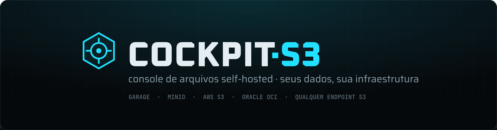
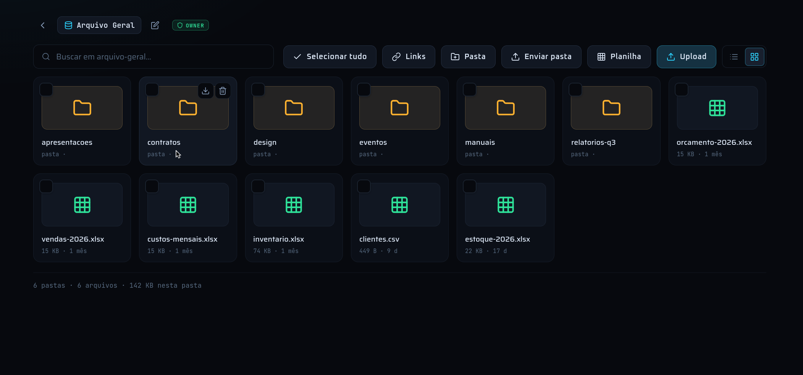
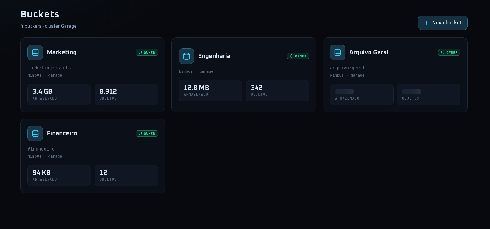
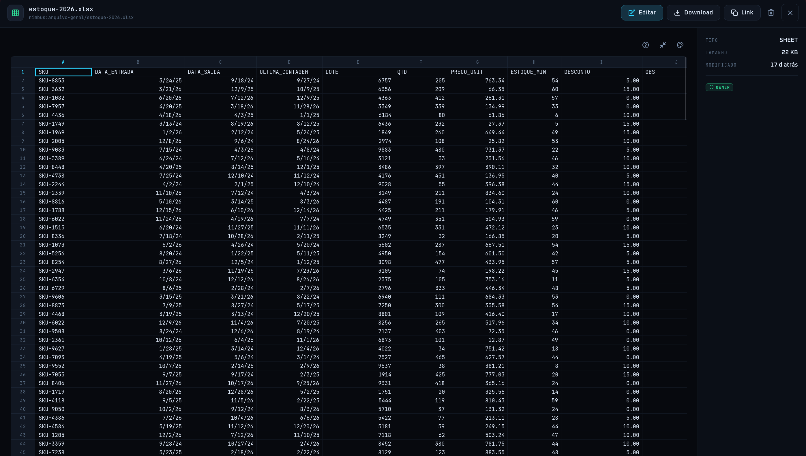
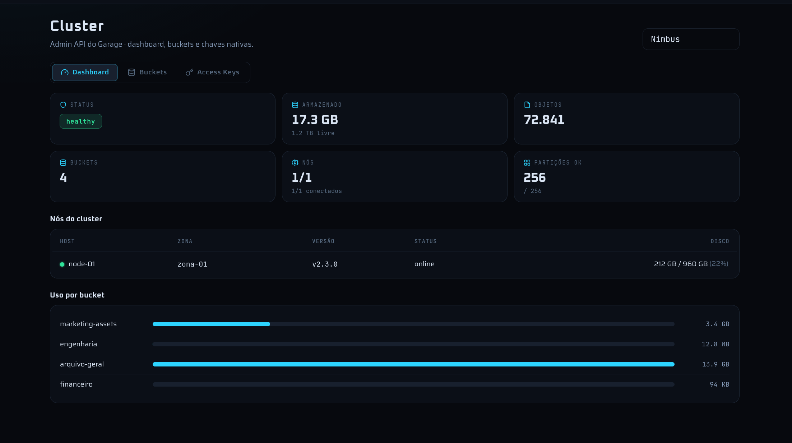

<div align="center">



<h3>Compartilhe arquivos sensíveis sem entregar suas chaves.</h3>

Um console web para object storage S3 que roda **na sua infraestrutura**.<br>
Permissões validadas no servidor, links públicos que expiram e travam por IP,<br>
criptografia em repouso e auditoria de tudo — com **usuários ilimitados**.

<br>

[](./LICENSE)
[](https://bun.sh)
[](https://vuejs.org)
[](#-rodando-a-imagem-de-produção)

[**Recursos**](#-o-que-ele-faz) · [**Segurança**](#-segurança--conformidade) · [**Comparativo**](#-o-meio-termo-que-faltava) · [**Desenvolvimento**](#-desenvolvimento) · [**Deploy**](#-deploy-no-dokploy) · [**FAQ**](#-perguntas-frequentes)

</div>

<br>

<p align="center">
  
</p>

## 🧭 O problema

Drive corporativo cobra caro — e mesmo assim você perde o controle.

|  |  |
| --- | --- |
| **🔗 O link que ninguém lembra quem tem** | Um contrato compartilhado por link público há oito meses. Ainda está no ar. Quem tem acesso hoje? Ninguém sabe responder. |
| **💸 A fatura que cresce com o time** | Cobrança por usuário, por mês. Cada pessoa nova é mais uma licença — e seus documentos continuam hospedados fora do país. |
| **🕵️ "Quem mexeu nesse arquivo?"** | Sem registro de quem enviou, baixou ou excluiu, a resposta para a auditoria é sempre um silêncio constrangedor. |

## ✨ O que ele faz

### 01 · Seus dados, sua infraestrutura

Roda no servidor da empresa ou em qualquer VPS. Nenhum arquivo trafega por nuvem de terceiros — argumento direto de **LGPD e soberania de dados**. O object storage é seu; o Cockpit só organiza o acesso a ele.

Compatível com **Garage, MinIO, AWS S3, Oracle OCI** e qualquer endpoint compatível com S3 — várias conexões no mesmo console.

<p align="center">
  
</p>

### 02 · Permissões de verdade, validadas no servidor

Uma matriz visual de **usuário × bucket** com quatro níveis, com ajuste fino **por pasta** quando precisar. Toda requisição é autorizada no backend — não é "esconder o botão no front".

| Nível | O que a pessoa pode fazer |
| --- | --- |
| `só ver` | Visualiza no navegador. **O download não existe** — o botão some e a API recusa. |
| `leitura` | Visualiza e baixa. |
| `escrita` | Envia, renomeia e exclui. |
| `dono` | Tudo isso, e ainda gerencia o bucket e quem tem acesso a ele. |

### 03 · Compartilhe com terceiros sem fricção

Crie um login para o parceiro em segundos — sem conta Google, sem licença. Ou gere um **link público que expira sozinho**, sem exigir login de quem recebe:

- validade de **1 hora a 30 dias**;
- **trava no primeiro IP** que abrir o link;
- revogação a qualquer momento;
- só quem tem permissão de compartilhar gera link — e nunca de um arquivo que a pessoa não poderia baixar.

### 04 · Visualize sem baixar

Preview inline de **PDF, imagem, vídeo e áudio** direto no navegador, com navegação entre os arquivos da pasta. Planilhas abrem num **editor embutido**, sem precisar baixar e reabrir no Excel.

<p align="center">
  
</p>

### 05 · Painel do cluster

Para quem roda **Garage**, o console fala com a Admin API: saúde do cluster, nós, partições, uso por bucket e chaves de acesso nativas — tudo numa tela.

<p align="center">
  
</p>

## 🚀 No ar em minutos, não em sprints

| | |
| --- | --- |
| **1. Suba o container** | Um `docker compose up` e pronto. Banco SQLite embutido — sem Postgres, sem Redis, sem PHP. |
| **2. Conecte seu storage** | Aponte para Garage, MinIO ou AWS S3 pela interface. Várias conexões, em um só lugar. |
| **3. Crie usuários e compartilhe** | Defina a matriz de permissões, crie o login do parceiro ou gere o link que expira. Mande. Pronto. |

## 🔐 Segurança & conformidade

A honestidade de engenharia é o estilo: o que está aqui, está validado no servidor. Sem teatro, sem jargão.

| | |
| --- | --- |
| **Criptografia em repouso** | Ativada por bucket. Cada arquivo é cifrado no servidor, com chave própria por objeto, antes de ir pro storage. No bucket ficam só blocos embaralhados de nome aleatório — backup, disco ou credencial vazada não revelam nada. Detalhes em [`docs/encryption.md`](./docs/encryption.md). |
| **Backup & recuperação (DR)** | Backup automático e cifrado das chaves e do índice para um destino que você escolhe. Se a máquina do console cair, você restaura tudo — e os arquivos, já no seu storage, nunca se perdem. |
| **LGPD & soberania** | Dados na sua infraestrutura, sob sua jurisdição. Nada cruza fronteira sem você mandar. |
| **Criptografia em trânsito** | TLS de ponta a ponta entre navegador, console e object storage. |
| **Auditoria nativa** | Linha do tempo de envio, download, exclusão e de quem concedeu ou revogou acesso. |
| **Arquitetura de tokens** | Senhas com argon2id, tokens curtos com revogação instantânea, refresh rotativo com detecção de roubo e rate-limit de login. |

## 🆚 O meio-termo que faltava

Leve como uma SaaS, soberano como um self-hosted — sem o peso das suítes tradicionais.

| | **Cockpit S3** | Suítes em nuvem | Self-hosted pesado |
| --- | :---: | :---: | :---: |
| Dados na sua infraestrutura | ✅ Sempre | ❌ Nuvem de 3º | ✅ Sim |
| Custo | ✅ Fixo | ❌ Por usuário | ➖ Servidor + tempo |
| Permissão validada no servidor | ✅ Sempre | ➖ Depende | ✅ Sim |
| Criptografia em repouso (server-side) | ✅ Por bucket | ➖ Lado do provedor | ❌ Raro |
| Link com expiração automática | ✅ 1h–30 dias | ➖ Manual | ➖ Plugin |
| Link travado por IP | ✅ Opcional | ❌ Não | ❌ Raro |
| Ver sem poder baixar | ✅ Nível próprio | ➖ Limitado | ❌ Não |
| Preview no navegador | ✅ Inline | ✅ Sim | ➖ Parcial |
| Peso operacional | ✅ 1 container | — (SaaS) | ❌ Pesado |

<sub>Comparação por categoria de produto, sem nomear marcas.</sub>

---

## 🧱 Arquitetura

Visual de **cockpit de caminhão**. Dois apps, um repositório:

```
cockpit-s3/
├── web/            SPA em Vue 3 + Vite + TypeScript (roda no Bun)
├── api/            API em Elysia + Bun (auth, S3, SQLite)
├── landing/        landing page estática
├── Dockerfile      builda o web e sobe a api servindo o SPA
├── docker-compose.yml
└── .env.example
```

Em **produção** a API serve o SPA buildado na mesma origem (sem CORS, uma porta, um volume), então tudo sai num **único container**.

## 💻 Desenvolvimento

Bun, dois processos:

```bash
# terminal 1 — API em :3000
cd api && bun install && bun run dev

# terminal 2 — web em :4200 (faz proxy de /api → :3000)
cd web && bun install && bun run dev
```

Abra http://localhost:4200. No primeiro boot é criado um admin a partir do `api/.env` (`ADMIN_USERNAME`/`ADMIN_PASSWORD`; senha em branco → uma aleatória é impressa no log). Cadastre sua conexão Garage/S3 em **Conexões** (admin).

Da raiz do repo também dá para usar `bun run dev:api` / `bun run dev:web`.

## 🐳 Rodando a imagem de produção

```bash
cp .env.example .env          # defina ACCESS_TOKEN_SECRET (openssl rand -hex 32)
docker compose up -d --build
# → http://localhost:3000   (web + /api na mesma origem)
docker compose logs -f        # pegue a senha aleatória do admin, se deixou em branco
```

O estado (banco SQLite) fica no volume `cockpit_data` — conexões, usuários e sessões sobrevivem a restarts e redeploys.

## 🚢 Deploy no Dokploy

Um container, um domínio. Dois caminhos:

<details>
<summary><b>A) Compose (recomendado — usa o <code>docker-compose.yml</code>)</b></summary>

1. **Create → Compose**, apontando para este repo (branch + root path `/`).
2. **Environment** — adicione no mínimo:
   ```
   ACCESS_TOKEN_SECRET=<openssl rand -hex 32>
   COOKIE_SECURE=true
   ADMIN_USERNAME=admin
   ADMIN_PASSWORD=<uma senha forte>
   ```
3. **Domains** — adicione seu domínio → serviço `cockpit-s3`, **porta `3000`**, HTTPS ligado. O proxy do Dokploy termina o TLS (por isso `COOKIE_SECURE=true` está correto).
4. **Deploy.** O volume `cockpit_data` persiste o banco.

</details>

<details>
<summary><b>B) Application (Dockerfile)</b></summary>

1. **Create → Application**, este repo, **Build type: Dockerfile** (`Dockerfile` da raiz).
2. Adicione as mesmas variáveis de ambiente acima.
3. Adicione um **Volume**: mount path `/data` (para o SQLite persistir).
4. **Domain** → porta `3000`, HTTPS ligado. Deploy.

</details>

> [!IMPORTANT]
> - **`ACCESS_TOKEN_SECRET` é obrigatório em produção** — a API encerra no boot se ele estiver ausente ou tiver menos de 32 caracteres. Não reaproveite o de desenvolvimento.
> - **`COOKIE_SECURE=true`** é necessário porque o cookie do refresh token só trafega por HTTPS; o Dokploy serve seu domínio com TLS.
> - **Backups**: faça snapshot do volume `/data` (`cockpit.sqlite`).
> - As conexões Garage/S3 são configuradas na interface e guardadas no banco — nenhuma credencial S3 precisa ir em variável de ambiente.

## 📚 Mais documentação

- `web/` — veja [`web/README.md`](./web/README.md) e o contrato da API em [`web/API.md`](./web/API.md).
- `api/` — veja [`api/README.md`](./api/README.md) (design de auth, estrutura, rotas).
- `landing/` — veja [`landing/README.md`](./landing/README.md).

## ❓ Perguntas frequentes

<details>
<summary><b>Preciso entender de S3 para usar?</b></summary>
<br>
Não. Você conecta o storage uma única vez pela interface; a partir daí é arrastar, soltar, definir permissão e compartilhar. O S3 fica nos bastidores.
</details>

<details>
<summary><b>Funciona com MinIO e AWS S3?</b></summary>
<br>
Sim. Qualquer endpoint compatível com S3 — Garage, MinIO, AWS S3, Oracle OCI, Wasabi, Backblaze. E dá para gerenciar várias conexões ao mesmo tempo pela própria interface.
</details>

<details>
<summary><b>Não tenho servidor nem storage. E agora?</b></summary>
<br>
Sem problema. A gente provisiona um bucket dedicado em nuvem para você — isolado, criptografado e só seu. Você não precisa montar infraestrutura nenhuma: assina, recebe o acesso e começa a usar. Fale com <b>cockpits3@pm.me</b>.
</details>

<details>
<summary><b>E o backup?</b></summary>
<br>
Seus arquivos ficam no seu object storage, sem silo proprietário. E o Cockpit ainda faz backup automático e cifrado das chaves de criptografia e do índice de metadados para um destino que você escolhe — se a máquina do console for perdida, você restaura o acesso a tudo em minutos. No plano gerenciado, a gente pode guardar essa cópia de recuperação por você.
</details>

<details>
<summary><b>Os arquivos ficam criptografados?</b></summary>
<br>
Podem ficar. Você ativa a criptografia em repouso por bucket: a partir daí cada arquivo é cifrado no servidor, com uma chave própria, antes de ser gravado — e no storage só existem blocos ilegíveis com nomes aleatórios. Quem obtiver o bucket, um backup ou o disco não lê nada. Para quem tem acesso no console, preview e download seguem normais: a cifragem é transparente.
</details>

<details>
<summary><b>Quantos usuários ele suporta?</b></summary>
<br>
Sem licença por usuário. 5 ou 500 contas custam o mesmo: só o disco. O custo escala com armazenamento, não com gente.
</details>

<details>
<summary><b>Como funciona o link que expira?</b></summary>
<br>
Quem tem permissão para compartilhar gera um link público de um arquivo — sem login para quem recebe. Você escolhe a validade (de 1 hora a 30 dias) e pode travar o acesso no primeiro IP que abrir: a partir daí, só aquele IP consegue ver. Dá para revogar a qualquer momento, e um usuário "só ver" nunca gera um link de download.
</details>

<details>
<summary><b>Tem app mobile?</b></summary>
<br>
Ainda não. A interface web é responsiva e funciona bem no celular para conferir e compartilhar arquivos. Apps nativos estão no roadmap — preferimos prometer só o que já entregamos.
</details>

<details>
<summary><b>É difícil de operar?</b></summary>
<br>
Um container, banco SQLite embutido, sem dependências externas. Sobe em minutos em qualquer servidor com Docker — incomparavelmente mais leve que as alternativas self-hosted tradicionais.
</details>

## 📄 Licença

[AGPL-3.0](./LICENSE). Para uso comercial fora dos termos da AGPL, veja [`COMMERCIAL-LICENSE.md`](./COMMERCIAL-LICENSE.md) ou escreva para **cockpits3@pm.me**.
